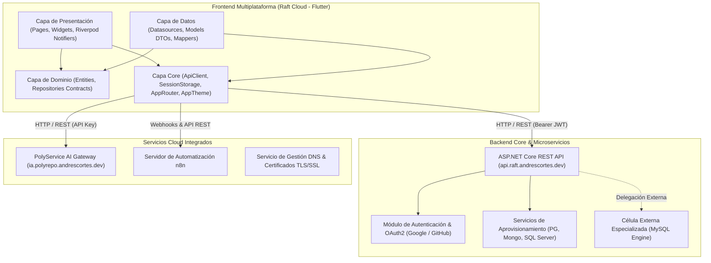
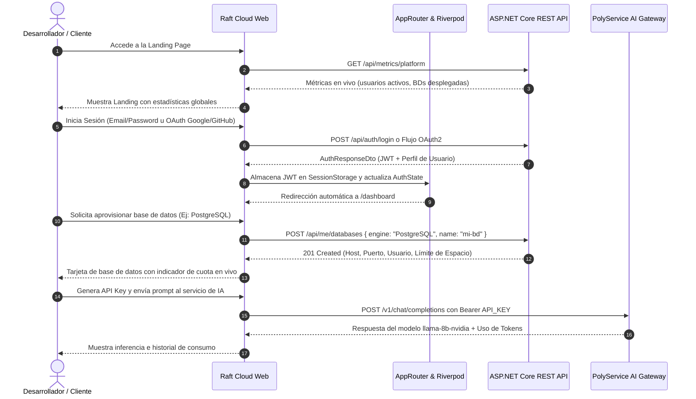
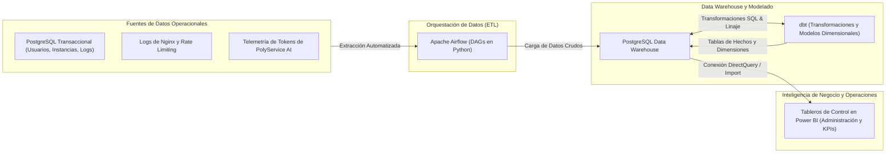
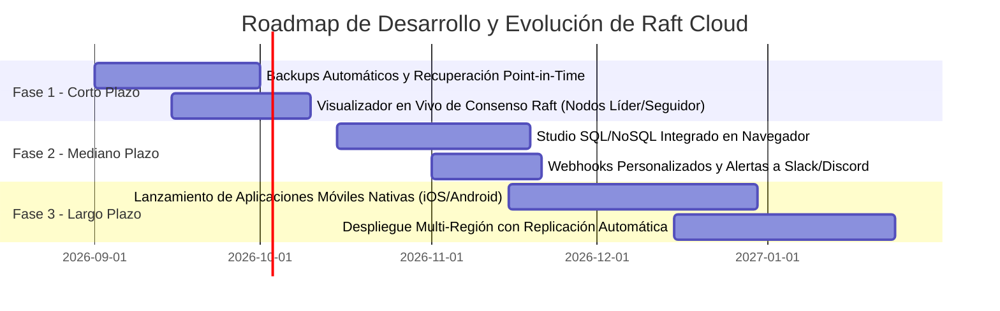
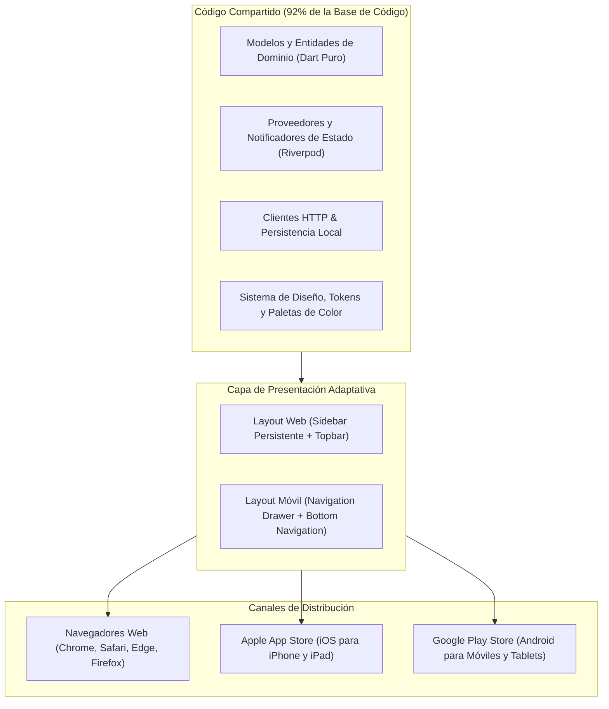

# Documento de Arquitectura, Funcionamiento y Pitch Técnico-Comercial: Raft Cloud (Raft)

---

## 1. Ficha Técnica del Producto

- **Nombre Oficial del Producto:** Raft Cloud (abreviado: Raft)
- **Dominio y Propósito:** Plataforma Integral Cloud de Autoservicio: Database-as-a-Service (DBaaS) Multi-Motor, Orquestación de Automatizaciones con n8n e Inferencia de Inteligencia Artificial (PolyService AI).
- **Tipo de Aplicación:** Plataforma Web de Autoservicio y Cliente Multiplataforma Nativo (Web, iOS, Android, macOS, Windows).
- **Lenguaje y SDK:** Dart 3.12+ / Flutter SDK
- **Gestor de Estado:** Flutter Riverpod (^2.6.1) con arquitectura reactiva basada en inmutabilidad.
- **Enrutamiento y Seguridad:** GoRouter (^17.3.0) con `PathUrlStrategy` (navegación limpia HTML5 sin `#`) y Route Guards automáticos para protección de rutas privadas.
- **Cliente de Red:** `http` (^1.2.2) encapsulado en `ApiClient` centralizado con inyección automática de cabecera `Authorization: Bearer <jwt>`, captura de excepciones tipadas (`ApiException`) y control de códigos HTTP 400, 401, 403, 429 y 500.
- **Almacenamiento Local Seguro:** `shared_preferences` (^2.3.2) encapsulado en `SessionStorage`.
- **Ecosistema de Microservicios Conectados:**
  - Backend Core REST API en ASP.NET Core (`https://api.raft.andrescortes.dev`).
  - Pasarela de Inteligencia Artificial PolyService AI (`https://ia.polyrepo.andrescortes.dev`).
  - Servidor de Automatización de Flujos n8n.
  - Clúster de Motores de Bases de Datos (PostgreSQL, MySQL, MongoDB, SQL Server).
- **Patrón Arquitectónico:** Clean Architecture organizada por Features (`Core`, `Auth`, `User`, `Landing`).

---

## 2. Resumen Ejecutivo y Propuesta de Valor (Pitch de Venta)

### 2.1. El Problema en la Industria Cloud

Los desarrolladores, startups y empresas de base tecnológica se enfrentan a un ecosistema de infraestructura fragmentado. Configurar bases de datos relacionales y NoSQL, administrar credenciales de acceso de forma segura, orquestar flujos de integración y desplegar capacidades de Inteligencia Artificial requiere lidiar con múltiples proveedores, paneles de control sobrecargados y complejas configuraciones de red. Esta dispersión genera sobrecostos operativos, pérdidas de tiempo y brechas de seguridad.

### 2.2. La Solución: Raft Cloud

Raft Cloud unifica los tres pilares del desarrollo moderno en una sola consola de autoservicio intuitiva y de alto rendimiento:

1. **Aprovisionamiento Multi-Motor Instantáneo:** Creación de bases de datos aisladas en segundos para PostgreSQL, MySQL, MongoDB y Microsoft SQL Server, con generación automática de credenciales, límites de almacenamiento controlados y monitoreo de consumo en tiempo real.
2. **Centro de Automatización con n8n:** Conexión nativa con motores de flujos de trabajo visuales, webhooks y tareas programadas integradas con las bases de datos del usuario.
3. **Servicios de Inteligencia Artificial (PolyService AI):** Inferencia de modelos de lenguaje de última generación (`llama-8b-nvidia`) mediante API Keys segmentadas por entorno (desarrollo, pruebas, producción), con control de cuotas y rate limiting transparente.
4. **Experiencia de Usuario de Primer Nivel:** Interfaz fluida a 60 FPS con temas Claro y Oscuro (Raft Day / Raft Night), paletas de color institucionales adaptativas por cada motor y documentación interactiva con ejemplos de código en seis lenguajes de programación.

### 2.3. Mercado Objetivo

- **Startups y Equipos de Ingeniería:** Aprovisionamiento rápido de entornos de desarrollo, staging y producción sin necesidad de un equipo dedicado de DevOps.
- **Empresas con Arquitecturas Políglotas:** Centralización de bases de datos relacionales y documentales bajo un esquema uniforme de facturación y cuotas.
- **Desarrolladores de Software:** Integración inmediata de automatizaciones e inferencia de IA en sus aplicaciones mediante SDKs y APIs estandarizadas.

---

## 3. Arquitectura del Sistema y Topología de Red

El cliente frontend de Raft Cloud implementa **Clean Architecture**, dividiendo cada módulo en capas estrictamente delimitadas:



### 3.1. Desglose de Capas en el Frontend

- **Capa de Dominio (`domain/`):** Contiene las entidades puras de negocio (`DatabaseInstance`, `DatabaseEngine`, `UserSession`, `UserProfile`). No contiene ninguna referencia a paquetes de interfaz de usuario ni librerías de red, lo que permite reutilizarla íntegramente en cualquier plataforma.
- **Capa de Datos (`data/`):** Define los modelos de transferencia de datos (DTOs) con serialización JSON segura (`fromJson`/`toJson`) y los Datasources que realizan las peticiones HTTP hacia el backend.
- **Capa de Presentación (`presentation/`):** Alberga las vistas de usuario (`pages/`) y los componentes visuales modulares (`widgets/`). El estado se maneja con `StateNotifierProvider` de Riverpod, separando la lógica de negocio de los ciclos de renderizado del árbol de widgets.
- **Capa Core (`core/`):**
  - `ApiClient`: Interceptor HTTP centralizado que inyecta automáticamente el token de autorización JWT, maneja tiempos de espera y transforma las respuestas del servidor en modelos tipados o excepciones de negocio (`ApiException`).
  - `SessionStorage`: Persistencia segura del token JWT en el almacenamiento local del dispositivo o navegador.
  - `AppRouter`: Enrutador declarativo basado en GoRouter con soporte para navegación web limpia y protección automática de rutas privadas.
  - `AppTheme`: Definición global de temas visuales (Raft Day / Raft Night) y asignación dinámica de colores institucionales para cada motor de base de datos.

---

## 4. Matriz de Integración y Protocolos de Comunicación

| Componente de Red                | URL Base / Endpoint                           | Mecanismo de Autenticación         | Funcionalidades Principales                                                                                                                                                      |
| :------------------------------- | :-------------------------------------------- | :---------------------------------- | :------------------------------------------------------------------------------------------------------------------------------------------------------------------------------- |
| **Backend REST Core**      | `https://api.raft.andrescortes.dev`         | `Authorization: Bearer <JWT>`     | Autenticación, métricas de plataforma, aprovisionamiento de bases de datos, cambio de estado (pausa/reanudación), revelado seguro de contraseñas y eliminación de recursos. |
| **PolyService AI Gateway** | `https://ia.polyrepo.andrescortes.dev`      | `Authorization: Bearer <API_KEY>` | Catálogo de modelos (`GET /v1/models`), inferencia de lenguaje (`POST /v1/chat/completions`) con el modelo `llama-8b-nvidia` y telemetría de tokens consumidos.          |
| **Servidor n8n**           | `https://n8n.raft.andrescortes.dev`         | `API Token / Webhooks`            | Listado y monitoreo de flujos de trabajo, activación y desactivación de pipelines y sincronización de eventos de bases de datos.                                              |
| **Gestión DNS & SSL**     | `https://api.raft.andrescortes.dev/api/dns` | `Authorization: Bearer <JWT>`     | Consulta de nombres de dominio asignados a las instancias y estado de vigencia de los certificados TLS/SSL emitidos.                                                             |

---

## 5. Recorrido Funcional End-to-End del Sistema



### 5.1. Landing Page Pública

- Métricas globales en tiempo real obtenidas desde `GET /api/metrics/platform` (total de usuarios registrados, bases de datos activas, logins consolidados).
- Presentación de arquitectura distribuida, características clave y comparativas de motores.
- Acceso directo a registro e inicio de sesión.

### 5.2. Sistema de Autenticación Híbrida

- **Autenticación Clásica:** Registro e inicio de sesión con correo electrónico y contraseña, con validaciones estrictas del lado del cliente y del servidor (`[Required]`, `[EmailAddress]`, `[MinLength]`).
- **Autenticación Federada OAuth2:** Soporte nativo para Google y GitHub con redirección web y procesamiento seguro de tokens en la ruta `/auth/callback`.
- **Gestión de Sesión:** Manejo de JWT con expiración a los 60 minutos y redirección automática al expirar.

### 5.3. Módulo de Gestión de Bases de Datos (Databases Page)

- **Aprovisionamiento Guiado:** Selección rápida de motor (PostgreSQL, MySQL, MongoDB, SQL Server) y versión deseada.
- **Telemetría de Almacenamiento en Vivo:** Barra de progreso con cálculo del espacio ocupado en bytes y megabytes frente al límite asignado (por ejemplo, 20 MB en el plan base).
- **Control de Ciclo de Vida:** Botones para pausar (detener) o reanudar instancias en motores compatibles.
- **Visualizador Seguro de Credenciales:** Diálogo interactivo con host, puerto, nombre de base de datos, usuario y botón de revelado de contraseña bajo demanda protegido por rate limiting (`GET /api/me/databases/{id}/password`).
- **Eliminación Controlada:** Flujo de borrado irreversible con diálogo modal de confirmación.

### 5.4. Módulo de Automatizaciones (n8n Services)

- Monitoreo del estado de ejecución de los flujos de trabajo (activos e inactivos).
- Visualización de webhooks y disparadores automáticos asociados a eventos de bases de datos.

### 5.5. Módulo de Inteligencia Artificial (PolyService AI)

- Creación y revocación de hasta tres API Keys independientes (ambientes de desarrollo, staging y producción).
- Consulta y validación del modelo de lenguaje `llama-8b-nvidia`.
- Monitoreo en tiempo real del límite de cuota (10 solicitudes por minuto y 100 solicitudes diarias por API Key, con hasta 1024 tokens de salida por solicitud).

### 5.6. Módulo de DNS & Certificados SSL

- Visor de nombres de dominio asignados a cada instancia (por ejemplo, `pg01.raftdb.dev`, `mysql01.raftdb.dev`).
- Verificación del estado de los certificados TLS/SSL para garantizar tráfico cifrado.

### 5.7. Centro de Documentación y Snippets de Código

- Guías de conexión listas para copiar en **Node.js, Python, C# (.NET), Java, Go y PHP**.
- Inyección dinámica de las credenciales del usuario en los ejemplos de código para facilitar su integración.

### 5.8. Configuración de Cuenta y Seguridad

- Visualización de perfil, proveedor de autenticación vinculado y cuotas asignadas.
- Selector de tema visual para alternar entre Raft Day y Raft Night.

---

## 6. Estrategia de Administración y Analítica Empresarial (Pipeline de BI)

Para cumplir con estándares corporativos de escalabilidad, auditoría y análisis de grandes volúmenes de datos, **el panel administrativo de Raft Cloud no se implementa como una vista monolítica dentro de la aplicación de usuario**, sino que opera a través de una arquitectura moderna de **Business Intelligence (BI)** y Data Warehousing completamente desacoplada:



### 6.1. Componentes del Flujo Analítico Administrativo

1. **Apache Airflow (Python):** Orquesta los pipelines de extracción periódica de datos desde la base de datos transaccional, logs de acceso y registros de consumo de IA.
2. **PostgreSQL Data Warehouse:** Repositorio analítico dedicado que aísla las consultas pesadas de administración para no afectar el rendimiento de la aplicación en producción.
3. **dbt (Data Build Tool):** Transforma los datos brutos en esquemas dimensionales (Star Schema) estructurados en tablas de hechos (consumo de almacenamiento, peticiones a la API de IA, creación y destrucción de instancias) y dimensiones (usuarios, planes, motores de base de datos, ubicaciones geográficas).
4. **Power BI Dashboard:** Tablero ejecutivo e interactivo que permite al equipo de operaciones y directivos:
   - Monitorear la disponibilidad y salud global de los clústeres de bases de datos.
   - Detectar patrones anómalos de tráfico, intentos de vulneración o abusos de rate limits.
   - Analizar métricas comerciales clave: Usuarios Activos Mensuales (MAU), tasa de conversión, costo por token de IA y proyección de uso de almacenamiento.
   - Tomar decisiones estratégicas de aprovisionamiento de infraestructura basadas en telemetría real.

---

## 7. Limitaciones Actuales y Manejo de Excepciones

Raft Cloud implementa políticas transparentes de control de recursos y límites operativos:

1. **Excepción del Motor MySQL (Gestión por Célula Externa):**
   - **Contexto Operativo:** El aprovisionamiento y ciclo de vida de MySQL se delega a una célula de infraestructura externa especializada.
   - **Comportamiento Visual:** En la tarjeta de la base de datos, el botón de "Pausar / Iniciar" permanece visible para conservar la simetría de la grilla, pero en estado desactivado, mostrando un `Tooltip` con el mensaje: *"Esta opción no está disponible para el motor MySQL"*.
   - **Protección en Capa de Lógica:** El método `userDatabasesProvider.toggleInstanceState()` incluye una cláusula de guardia que intercepta cualquier intento de invocación para bases de datos MySQL, evitando llamadas infructuosas al backend.
2. **Políticas de Rate Limiting:**
   - Límite global por IP: 120 peticiones por minuto.
   - Endpoints de autenticación (`/api/auth/*`): 10 peticiones por minuto.
   - Revelado de contraseñas (`/api/me/databases/{id}/password`): 5 peticiones por minuto por usuario.
3. **Límites de Inferencia de Inteligencia Artificial:**
   - Hasta 3 API Keys por cuenta de usuario.
   - 10 solicitudes por minuto y 100 solicitudes diarias por API Key.
   - Límite de 1024 tokens de salida por solicitud; sin soporte para streaming en la versión actual.
4. **Límites de Almacenamiento Base:**
   - 20 MB por instancia de base de datos en el plan estándar de evaluación.

---

## 8. Oportunidades de Mejora y Roadmap Estratégico



1. **Visualizador de Consenso Raft en Tiempo Real:** Interfaz interactiva que ilustre el estado de los nodos del clúster Raft (Líder, Seguidores, Candidatos), los procesos de elección de líder y la replicación del log de transacciones.
2. **Backups Automáticos y Snapshots:** Programación de copias de seguridad automáticas con descarga de volcados de datos cifrados y restauración a un punto en el tiempo (PITR).
3. **Consola SQL/NoSQL Integrada (In-Browser Studio):** Editor interactivo en el navegador para ejecutar consultas SQL y agregaciones MongoDB directamente desde la plataforma sin necesidad de clientes externos como DBeaver o pgAdmin.
4. **Sistema de Alertas y Webhooks:** Notificaciones automáticas hacia Slack, Discord o correo cuando el almacenamiento alcance el 85% de la cuota asignada.
5. **Infraestructura Multi-Región:** Replicación geográfica de bases de datos para garantizar baja latencia y tolerancia a fallos a nivel global.

---

## 9. Justificación Tecnológica: ¿Por qué este Stack?

### 9.1. Flutter Multiplatform y Dart

- **Base de Código Unificada:** Un solo código fuente da soporte a Web, iOS, Android, macOS y Windows, reduciendo los costos de desarrollo y mantenimiento en más de un 60%.
- **Renderizado Gráfico Directo:** Gracias a su motor de renderizado propio (CanvasKit / Skia / Impeller), la aplicación garantiza una tasa constante de 60 FPS y una consistencia visual absoluta en cualquier navegador o sistema operativo.
- **Tipado Fuerte y Seguridad:** El compilador de Dart detecta inconsistencias de tipos en tiempo de compilación, eliminando fallos en producción.

### 9.2. Flutter Riverpod

- **Gestión de Estado Reactiva e Inmutable:** Desacopla por completo la lógica de negocio del árbol de widgets, permitiendo un flujo de datos unidireccional y predecible.
- **Facilidad de Pruebas Unitarias:** Facilita la inyección de dependencias y el reemplazo de datasources para pruebas automatizadas (`ProviderContainer.overrideWithValue`).
- **Control de Memoria:** Destrucción automática de estados en desuso mediante modificadores `autoDispose`.

### 9.3. GoRouter

- **Enrutamiento Declarativo:** Integración nativa con el historial de navegación web, botones Atrás/Adelante y soporte para Deep Linking.
- **Route Guards Centralizados:** Validación síncrona y asíncrona de autenticación antes de permitir el acceso a rutas protegidas.

---

## 10. Adaptabilidad y Futura Aplicación Móvil (iOS y Android)

Raft Cloud fue concebido desde sus cimientos bajo una filosofía **Mobile-First y Responsive**:



### 10.1. Claves para el Despliegue en Tiendas Móviles

- **Reutilización Masiva de Código:** Más del 92% de la base de código (capas de Dominio, Datos, Core y lógica de estado de Riverpod) se comparte de forma directa sin requerir modificaciones.
- **Diseño Adaptativo Incorporado:** La interfaz utiliza `LayoutBuilder` y puntos de quiebre (breakpoints a 900px) que transforman de forma fluida el menú lateral en un `NavigationDrawer` táctil en pantallas móviles.
- **Rendimiento Nativo AOT:** En iOS y Android, Flutter compila directamente a código máquina nativo (ARM64), ofreciendo tiempos de carga inmediatos y bajo consumo de batería.

---

## 11. Estimación de Tiempos de Producción y Fases de Despliegue

| Fase del Proyecto                                             | Duración Estimada                | Entregables y Criterios de Aceptación                                                                                                                         |
| :------------------------------------------------------------ | :-------------------------------- | :------------------------------------------------------------------------------------------------------------------------------------------------------------- |
| **Fase 1: Hardening de Seguridad y Auditoría**         | 3 Semanas                         | Pruebas de penetración (OWASP ZAP), verificación de rate limits, validación de expiración y renovación de JWT y protección de secretos.                  |
| **Fase 2: Pipeline de BI y Despliegue de Airflow/dbt**  | 4 Semanas                         | Construcción de DAGs en Airflow, modelado dimensional con dbt en PostgreSQL Data Warehouse y publicación de tableros de control en Power BI.                 |
| **Fase 3: Infraestructura Cloud y Alta Disponibilidad** | 3 Semanas                         | Configuración de Nginx Reverse Proxy, certificados SSL automatizados con Let's Encrypt, clúster de bases de datos productivas y CDN para assets estáticos.  |
| **Fase 4: Compilación y Distribución Móvil**         | 4 Semanas                         | Generación de bundles de producción (`.aab` para Google Play y `.ipa` para Apple App Store), pruebas en dispositivos físicos y publicación en tiendas. |
| **Total Estimado a Producción Comercial**              | **14 Semanas (~3.5 Meses)** | **Plataforma Integral Raft Cloud Web y Móvil con Monitoreo de BI Operativo.**                                                                           |

---

## 12. Árbol Jerárquico de Widgets del Frontend

Estructura modular y organizada de los componentes de la interfaz de usuario:

```text
MaterialApp.router (lib/main.dart)
├── ProviderScope (Riverpod Root)
└── GoRouter (lib/src/core/routers/app_router.dart)
    │
    ├── / (LandingPage)
    │   ├── LandingNavbar (Logo Raft, Enlaces de Navegación, Botón Iniciar Sesión)
    │   ├── HeroSection (Título Principal, Métricas en Vivo, Botón de Registro)
    │   ├── FeaturesSection (Tarjetas de Características y Capacidades DBaaS)
    │   ├── EngineComparisonSection (Comparativa PostgreSQL, MySQL, Mongo, SQL Server)
    │   └── LandingFooter (Enlaces Institucionales, Documentación y Copyright)
    │
    ├── /login & /register (AuthPages)
    │   ├── AuthCardContainer (Diseño Glassmorphism y Elevación)
    │   ├── AuthForm (TextFormFields con Validación de Contraseña y Correo)
    │   ├── SocialLoginButtons (Botones de Autenticación con Google y GitHub)
    │   └── AuthErrorBanner (Alertas Visuales de Error de Autenticación)
    │
    ├── /auth/callback (AuthCallbackPage - Captura de Token OAuth2)
    │
    └── /dashboard (DashboardPage - Orquestador con Drawer y Sidebar)
        ├── DashboardSidebar (Navegación Lateral con Resaltado de Ruta Activa)
        ├── DashboardTopbar (Buscador, Alertas, Selector Raft Day/Night, Perfil)
        │
        ├── [Tab 0] OverviewPage
        │   ├── WelcomeBanner (Saludo al Usuario y Estado del Plan)
        │   ├── MetricsRow (Consumo de Almacenamiento, Instancias Activas, Tokens IA)
        │   ├── StorageUsageChart (Gráfico Personalizado con UsageChartPainter)
        │   └── RecentActivityList (Historial de Creación, Pausa y Eliminación)
        │
        ├── [Tab 1] DatabasesPage
        │   ├── DatabasesToolbar (Buscador, Filtro por Motor, Botón Nueva Instancia)
        │   ├── DatabaseGrid (Layout Responsivo con Wrap y LayoutBuilder)
        │   │   └── DatabaseManagementCard (Tarjeta Principal con Resplandor Hover)
        │   │       ├── DatabaseCardHeader (Logo Oficial PNG, Nombre, Versión, StatusBadge)
        │   │       ├── DatabaseCardInfoGrid (Host, Puerto, Base de Datos, Usuario)
        │   │       ├── DatabaseStorageProgress (Barra de Consumo en Megabytes)
        │   │       └── DatabaseCardActions (Fila de Botones de Acción)
        │   │           ├── OutlinedButton (Ver Credenciales -> CredentialsDialog)
        │   │           ├── Tooltip + OutlinedButton (Pausar/Iniciar -> Con Bloqueo MySQL)
        │   │           └── IconButton (Eliminar Instancia -> ConfirmDialog)
        │   └── EmptyDatabasesView (Vista de Estado Vacío con Llamado a la Acción)
        │
        ├── [Tab 2] N8nServicesPage
        │   ├── N8nSummaryCards (Workflows Activos, Total de Disparadores)
        │   ├── N8nWorkflowsList (Lista de Pipelines con Estado de Ejecución)
        │   └── N8nQuickActions (Acceso a Consola Web y Configuración de Webhooks)
        │
        ├── [Tab 3] AiServicesPage
        │   ├── AiServiceHeader (Descripción del Modelo llama-8b-nvidia)
        │   ├── ApiKeyManagementCard (Generación y Revocación de Llaves por Ambiente)
        │   ├── QuotaUsageIndicator (Monitoreo de Solicitudes por Minuto y Día)
        │   └── TestConsoleWidget (Consola Rápida para Probar Prompts y Tokens)
        │
        ├── [Tab 4] DnsSslPage
        │   ├── DnsRecordsTable (Hosts Asignados, Direcciones IP y Tipo de Registro)
        │   └── SslCertificateStatusCard (Vigencia de Certificados TLS/SSL)
        │
        ├── [Tab 5] DocumentationPage
        │   ├── LanguageSelectorTabs (Node.js, Python, C#, Java, Go, PHP)
        │   ├── CodeSnippetViewer (Visor de Código con Botón de Copiado)
        │   └── StepByStepGuides (Guías de Conexión y Buenas Prácticas)
        │
        └── [Tab 6] AccountPage
            ├── UserProfileCard (Avatar, Nombre, Correo, Proveedor Vinculado)
            ├── QuotaSummaryCard (Límites Globales Asignados a la Cuenta)
            └── SecuritySettings (Gestión de Credenciales y Sesiones Activas)
```

---

## 13. Conclusión del Valor de Inversión

**Raft Cloud (Raft)** representa una solución tecnológica sólida, escalable y comercialmente competitiva. Su enfoque unificado de **Database-as-a-Service**, **Automatizaciones** e **Inteligencia Artificial**, respaldado por una arquitectura desacoplada y una estrategia de administración basada en **Business Intelligence (Airflow, dbt, PostgreSQL DWH y Power BI)**, garantiza alta disponibilidad, control exhaustivo de costos y una experiencia de usuario de nivel empresarial tanto en la web como en futuras aplicaciones móviles.
